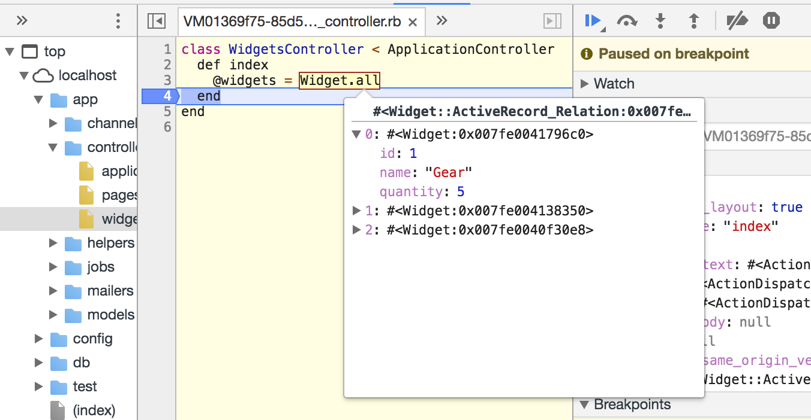

# 🐞 Ladybug

ladybug is a visual debugger for Ruby web applications that uses
Chrome Devtools as a user interface.

It aims to provide a rich backend debugging experience in a UI that many
web developers are already familiar with for debugging frontend Javascript.

**This project is currently in a very early experimental phase.** Expect many limitations and bugs, and use at your own risk. If you try it out, please file
Github issues or [email me](mailto:gklitt@gmail.com) to help make this a
more useful tool.



## Get started

Install the gem:

`gem install --pre ladybug`

ladybug is implemented as a Rack middleware, so you'll need to add
`Ladybug::Middleware` to the Rack middleware stack.
For example, in Rails 5, add
the following line to `config/application.rb`:

```
config.middleware.insert_before(Rack::Sendfile, Ladybug::Middleware)
```

Then start up your server and try making a request.
You should see your server program output something like:

`Debug in Chrome: chrome-devtools://devtools/bundled/inspector.html?ws=localhost:3000`

Navigate to that URL, and you'll see a Chrome Devtools window.
In the Sources tab, you can view your Ruby source code.
If you set a breakpoint and then make another request to your server,
it should pause on the breakpoint and you'll be able to inspect
some variables in Devtools.

## Development status

* basic pause/continue breakpoint control is supported, but "step over" and "step into" aren't fully supported yet.
* inspecting primtive objects like strings and numbers works okay; support for more complex objects is in development.
* So far, ladybug has only been tested with simple Rails applications running on
Rails 5 with the puma web server. Eventually it aims to support more Rack
applications and web servers (and perhaps even non-Rack applications).

## Author

[@geoffreylitt](https://twitter.com/geoffreylitt)


